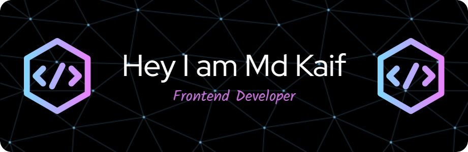

# 💫 About Me:
👋 Hi there, I'm MD KAIF! 🔥 Passionate Front-End Developer  🛠️ Skilled in React.js, JavaScript, HTML5, and CSS3  🌱 Currently learning Express.js and back-end development  👯 Open to collaborating on React-based and full-stack projects  💬 Ask me about React.js — I love building beautiful user interfaces!  📫 Reach me at: mdkaif8100@gmail.com  ⚡ Fun fact:  "Coding is like magic — if you get the syntax wrong, the spell doesn't work! 🪄💻"

## 🌐 Socials:
     

# 💻 Tech Stack:
             
# 📊 GitHub Stats:
 
 

## 🏆 GitHub Trophies

### ✍️ Random Dev Quote

### 🔝 Top Contributed Repo

---

<!-- Proudly created with GPRM ( https://gprm.itsvg.in ) -->
